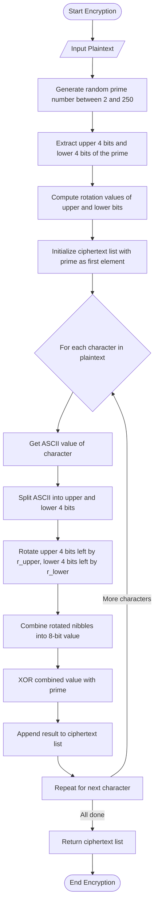
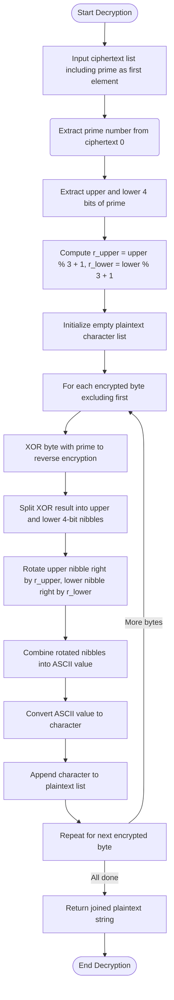

<p align="center">
  
</p>

<h3 align="center">
  Hajee Mohammad Danesh Science and Technology University,Dinajpur-5200.
</h3>
<h3 align="center">
<b></b>Assignment Name: NibbleDance Cipher<b></b>
</h3>

<h3 align="center">
  Course Title: Mathematical Analysis for Computer Science
</h3>

<h3 align="center">
  Course Code: CSE 361
</h3>
<br>
<h1 align="center">Submitted By</h1>

 <p align="center">Sultan Mahamud Opu<br>Student ID: 2102040<br>Level: 3 Semester: II<br>Department of Computer Science and Engineering</p>
 <br>

<h1 align="center">Submitted To</h1>

 <p align="center">Pankaj Bhowmik<br>Lecturer<br>Department of Computer Science and Engineering</p>


<br><br><br>

----
# NibbleDance Cipher – A Pseudo Random Prime-Keyed Rotational Nibble-Based Encryption Algorithm

## Table of Contents
- [Overview](#overview)
- [Introduction](#introduction)
- [Encryption Process](#encryption-process)
- [Decryption Process](#decryption-process)
- [Examples with Test Cases](#examples-with-test-cases)
  - [Example 1: "Sultan321"](#example-1-sultan321)
  - [Example 2: "Hello@332"](#example-2-hello332)
- [Benefits of NibbleDance Cipher](#benefits-of-nibbledance-cipher)
- [Comparison Table](#conclusion)
- [Conclusion](#conclusion)
- [References](#references)
- [Source Code](#source-code)
  

## Overview
**NibbleDance Cipher** is a lightweight symmetric key cryptographic algorithm that operates on the nibbles (4-bit halves) of ASCII characters. It employs bit-level transformations such as circular rotations and bitwise XOR, along with a dynamically generated prime number key. The algorithm is designed for simplicity and efficiency, making it well-suited for resource-constrained systems or educational cryptographic applications.

This cipher is named "NibbleDance" due to the way it rotates and shifts 4-bit nibbles, creating a "dance" of bits that enhances diffusion and complexity in the ciphertext.

## Introduction
Cryptographic algorithms are essential for data privacy and secure communication. Traditional algorithms like AES and RSA are powerful but often heavy for lightweight applications. **NibbleDance Cipher** offers a novel and simple alternative for educational purposes, small devices, or custom protocols where lightweight encryption is required.

This algorithm utilizes:

- Random prime keys (between 2 and 250),
- Bitwise rotation on 4-bit nibbles,
- XOR operation for confusion.

It ensures reversible and secure encryption with a compact transformation process.

## Encryption Process
Steps:
1. Generate a random prime number `p` (2 ≤ p ≤ 250).
2. Split `p` into upper and lower 4-bit nibbles.
3. Derive rotation counts:
   - `r_upper = (upper_p % 3) + 1`
   - `r_lower = (lower_p % 3) + 1`
4. For each character in the plaintext:
   - Convert it to ASCII.
   - Split it into 4-bit nibbles: upper and lower.
   - Rotate each nibble left by `r_upper` and `r_lower`.
   - Merge and XOR the result with `p`.
5. Return ciphertext as a list of integers, prefixed with the key `p`.

---
## Encryption Flowchart



## Decryption Process
Steps:
1. Extract the prime key `p` from the first element.
2. Recalculate `r_upper` and `r_lower` using the same method.
3. For each encrypted value:
   - XOR with `p`.
   - Split into upper and lower nibbles.
   - Rotate them right by `r_upper` and `r_lower`.
   - Reconstruct original ASCII character.
  
---
## Decryption Flowchart



## Examples with Test Cases

### Example 1: Encrypting & Decrypting "Sultan321"
Original Plaintext: `Sultan321`

- Random Prime `p`: 211
- `upper_p = 13`, `lower_p = 3`
- `r_upper = 2`, `r_lower = 1`

### Encryption Table
| Char | ASCII | Upper | Lower | Rot. Upper | Rot. Lower | Combined | XOR with p | Encrypted |
|------|-------|--------|--------|-------------|--------------|-----------|--------------|------------|
| S | 83 | 5 | 3 | 1 | 6 | 22 | 193 | 193 |
| u | 117 | 7 | 5 | 14 | 10 | 234 | 57 | 57 |
| l | 108 | 6 | 12 | 9 | 6 | 150 | 69 | 69 |
| t | 116 | 7 | 4 | 14 | 8 | 232 | 59 | 59 |
| a | 97 | 6 | 1 | 9 | 2 | 146 | 89 | 89 |
| n | 110 | 6 | 14 | 9 | 7 | 151 | 92 | 92 |
| 3 | 51 | 3 | 3 | 12 | 6 | 198 | 77 | 77 |
| 2 | 50 | 3 | 2 | 12 | 4 | 196 | 79 | 79 |
| 1 | 49 | 3 | 1 | 12 | 2 | 194 | 81 | 81 |

**Ciphertext**: `[211, 193, 57, 69, 59, 89, 92, 77, 79, 81]`  

### Decryption Table

| Encrypted | Combined | Rot. Upper | Rot. Lower | Upper | Lower | ASCII | Char |
| --- | --- | --- | --- | --- | --- | --- | --- |
| 193 | 22 | 1 | 6 | 5 | 3 | 83 | S |
| 57 | 234 | 14 | 10 | 7 | 5 | 117 | u |
| 69 | 150 | 9 | 6 | 6 | 12 | 108 | l |
| 59 | 232 | 14 | 8 | 7 | 4 | 116 | t |
| 89 | 146 | 9 | 2 | 6 | 1 | 97 | a |
| 92 | 151 | 9 | 7 | 6 | 14 | 110 | n |
| 77 | 198 | 12 | 6 | 3 | 3 | 51 | 3 |
| 79 | 196 | 12 | 4 | 3 | 2 | 50 | 2 |
| 81 | 194 | 12 | 2 | 3 | 1 | 49 | 1 |

**Decrypted Text**: `Sultan321`

### Example 2: Encrypting & Decrypting "Hello@332"
Original Plaintext: `Hello@332`

- Random Prime `p`: 131
- `upper_p = 8`, `lower_p = 3`
- `r_upper = 2`, `r_lower = 1`

### Encryption Table

| Char | ASCII | Upper | Lower | Rot. Upper | Rot. Lower | Combined | XOR with p | Encrypted |
|------|-------|--------|--------|-------------|--------------|-----------|--------------|------------|
| H | 72 | 4 | 8 | 1 | 0 | 16 | 147 | 147 |
| e | 101 | 6 | 5 | 9 | 10 | 154 | 25 | 25 |
| l | 108 | 6 | 12 | 9 | 6 | 150 | 21 | 21 |
| l | 108 | 6 | 12 | 9 | 6 | 150 | 21 | 21 |
| o | 111 | 6 | 15 | 9 | 7 | 151 | 20 | 20 |
| @ | 64 | 4 | 0 | 1 | 0 | 16 | 147 | 147 |
| 3 | 51 | 3 | 3 | 12 | 6 | 198 | 69 | 69 |
| 3 | 51 | 3 | 3 | 12 | 6 | 198 | 69 | 69 |
| 2 | 50 | 3 | 2 | 12 | 4 | 196 | 71 | 71 |

**Ciphertext**: `[131, 147, 25, 21, 21, 20, 147, 69, 69, 71]`  

### Decryption Table

| Encrypted | Combined | Rot. Upper | Rot. Lower | Upper | Lower | ASCII | Char |
| --- | --- | --- | --- | --- | --- | --- | --- |
| 147 | 16 | 1 | 0 | 4 | 8 | 72 | H |
| 25 | 154 | 9 | 10 | 6 | 5 | 101 | e |
| 21 | 150 | 9 | 6 | 6 | 12 | 108 | l |
| 21 | 150 | 9 | 6 | 6 | 12 | 108 | l |
| 20 | 151 | 9 | 7 | 6 | 15 | 111 | o |
| 147 | 16 | 1 | 0 | 4 | 0 | 64 | @ |
| 69 | 198 | 12 | 6 | 3 | 3 | 51 | 3 |
| 69 | 198 | 12 | 6 | 3 | 3 | 51 | 3 |
| 71 | 196 | 12 | 4 | 3 | 2 | 50 | 2 |

**Decrypted Text**: `Hello@332`

---
## Benefits of NibbleDance Cipher

-  **Lightweight**: Operates on 4-bit nibbles; ideal for small devices.
-  **Dynamic Keys**: Uses randomly generated prime number for each session.
-  **Reversible**: Perfect symmetry between encryption and decryption.
-  **Obfuscation**: Combines rotations and XORs for strong confusion and diffusion.
---
# Table 1.1: NibbleDance Cipher vs Other Algorithms: Key Differences

| **Feature**             | **NibbleDance Cipher**                                                                 | **Caesar Cipher**                    | **Vigenère Cipher**                      | **AES (Advanced Encryption Standard)**             |
|-------------------------|-----------------------------------------------------------------------------------------|--------------------------------------|------------------------------------------|----------------------------------------------------|
| **Type**                | Custom, symmetric, nibble-based                                                        | Classical, symmetric                 | Classical, polyalphabetic                | Modern, symmetric block cipher                     |
| **Key Structure**       | Random prime number + derived nibble-based rotations                                   | Single shift value (integer)         | Keyword (string)                         | 128/192/256-bit key                                |
| **Substitution Logic**  | Rotational nibble substitution using prime-derived rotation counts                     | Simple letter shift                  | Letter shift based on keyword            | Complex S-box substitution                         |
| **Permutation**         | Yes (through bit/nibble reordering or transformation based on prime)                  | ❌                                     | ❌                                       | Implicit permutation in rounds                     |
| **Modular Arithmetic**  | Core principle: nibble-wise modular operations using prime rotation values             | Addition mod 26                      | Addition mod 26                          | Finite field arithmetic (GF(2⁸))                   |
| **Decryption Needs**    | Inverse rotations + recombination of original nibbles                                 | Reverse shift                        | Reverse keyword-based shift              | Reverse rounds using inverse S-box and keys        |
| **Educational Purpose** | Designed for cryptographic learning and demonstrating pseudo-random transformations   | Historical only                      | Historical, basic cryptography           | Real-world industrial standard                     |
| **Security Strength**   | Moderate (suitable for educational and demonstrative uses)                             | Very weak                            | Weak (easily broken)                     | Strong (global standard, widely adopted)           |
| **Block-Based?**        | Yes (character-level processing via 4-bit nibbles)                                     | No                                   | No                                       | Yes (128-bit blocks)                               |
| **Customizability**     | High (prime choice, rotation rules, nibble structure can be tuned)                     | Low                                  | Medium                                   | Low (fixed key and operation configuration)        |

---
## Conclusion
**NibbleDance Cipher** is a custom-designed, lightweight encryption scheme that demonstrates how prime numbers, nibble-wise operations, and logical bit manipulation can be combined to produce a secure and reversible cipher. It is ideal for educational purposes, embedded systems, and applications needing fast symmetric encryption.

## References
- Stallings, William. *Cryptography and Network Security: Principles and Practice*.
- Wikipedia: [Bitwise Operation](https://en.wikipedia.org/wiki/Bitwise_operation)
- Python Documentation: `random` module

## Source Code
```python
import random
import string 

def rotate_left_4(num: int, shift: int) -> int:
    shift %= 4
    return ((num << shift) | (num >> (4 - shift))) & 0xF

def rotate_right_4(num: int, shift: int) -> int:
    shift %= 4
    return ((num >> shift) | (num << (4 - shift))) & 0xF

def is_prime(n: int) -> bool:
    if n < 2: return False
    for i in range(2, int(n**0.5) + 1):
        if n % i == 0: return False
    return True

def generate_prime() -> int:
    primes = [p for p in range(2, 251) if is_prime(p)]
    return random.choice(primes)

def encrypt(plaintext: str) -> list[int]:
    p = generate_prime()
    upper_p = (p >> 4) & 0xF
    lower_p = p & 0xF
    r_upper = (upper_p % 3) + 1
    r_lower = (lower_p % 3) + 1
    ciphertext = [p]
    for char in plaintext:
        n = ord(char)
        if n > 255:
            # print(f"Warning: Character '{char}' (ordinal {n}) is outside the 0-255 range and may not encrypt/decrypt correctly.")
            n = n % 256 

        upper = (n >> 4) & 0xF
        lower = n & 0xF
        upper_rot = rotate_left_4(upper, r_upper)
        lower_rot = rotate_left_4(lower, r_lower)
        combined = (upper_rot << 4) | lower_rot
        encrypted_char_val = combined ^ p
        ciphertext.append(encrypted_char_val)
    return ciphertext

def decrypt(ciphertext: list[int]) -> str:
    p = ciphertext[0]
    upper_p = (p >> 4) & 0xF
    lower_p = p & 0xF
    r_upper = (upper_p % 3) + 1
    r_lower = (lower_p % 3) + 1
    plaintext_chars = []
    for c in ciphertext[1:]:
        combined = c ^ p
        upper_rot = (combined >> 4) & 0xF
        lower_rot = combined & 0xF
        upper = rotate_right_4(upper_rot, r_upper)
        lower = rotate_right_4(lower_rot, r_lower)
        decrypted_val = (upper << 4) | lower
        plaintext_chars.append(chr(decrypted_val))
    return ''.join(plaintext_chars)

# Test Case
plaintext = input("Enter your Plaintext: ")
encrypted_int_list = encrypt(plaintext)
decrypted = decrypt(encrypted_int_list)


character_pool = string.ascii_lowercase + string.ascii_uppercase + string.digits
pool_size = len(character_pool)

encrypted_alphanumeric_string_chars = []
for num in encrypted_int_list:
    mapped_char_index = num % pool_size
    mapped_char = character_pool[mapped_char_index]
    encrypted_alphanumeric_string_chars.append(mapped_char)

encrypted_alphanumeric_string = "".join(encrypted_alphanumeric_string_chars)


print(f"Plaintext: {plaintext}")
print(f"Ciphertext (integer list with embedded key): {encrypted_int_list}")
print(f"Ciphertext: {encrypted_alphanumeric_string}")
print(f"Decrypted: {decrypted}")


```

